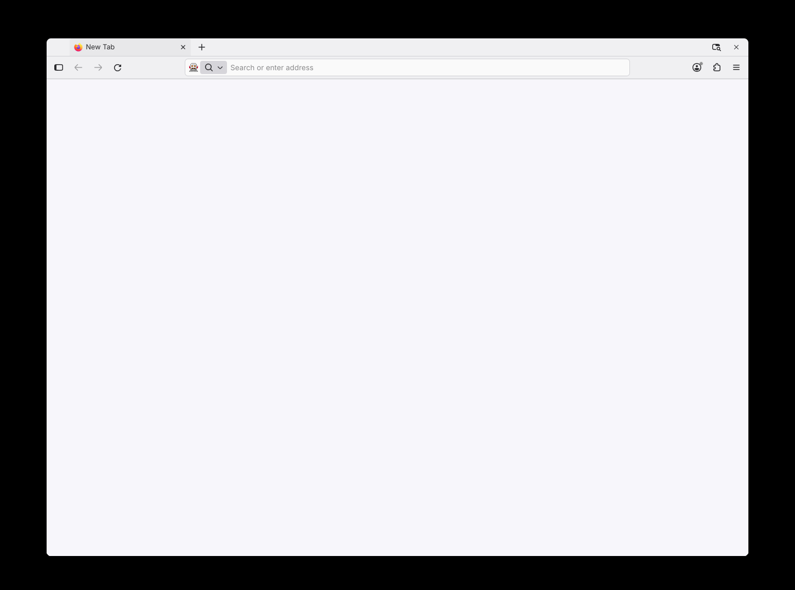
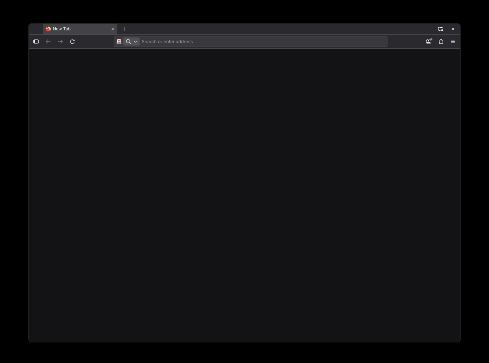

# Renderorange Firefox Theme

A `userChrome.css` theme that walks back Firefox's post-137 redesign — square-ish
buttons and tabs with a slight radius, a reconnected contiguous toolbar block, a
flat URL bar — on a soft, pure-grayscale palette that follows your system
light/dark scheme.

## Install

1. Open `about:config`, accept the warning, search for
   `toolkit.legacyUserProfileCustomizations.stylesheets`, and set it to `true`.
2. Open `about:support` and click **Open Directory** next to
   "Profile Directory".
3. Inside the profile directory, create a `chrome/` folder if it doesn't already
   exist.
4. Drop `userChrome.css` into the `chrome/` folder.
5. Restart Firefox.

Tested against Firefox 157.0 on Linux.

## Uninstall

Delete `userChrome.css` from your profile's `chrome/` folder and restart Firefox.
Optionally, set `toolkit.legacyUserProfileCustomizations.stylesheets` back to
`false`.

## License

MIT — see [LICENSE](LICENSE).
